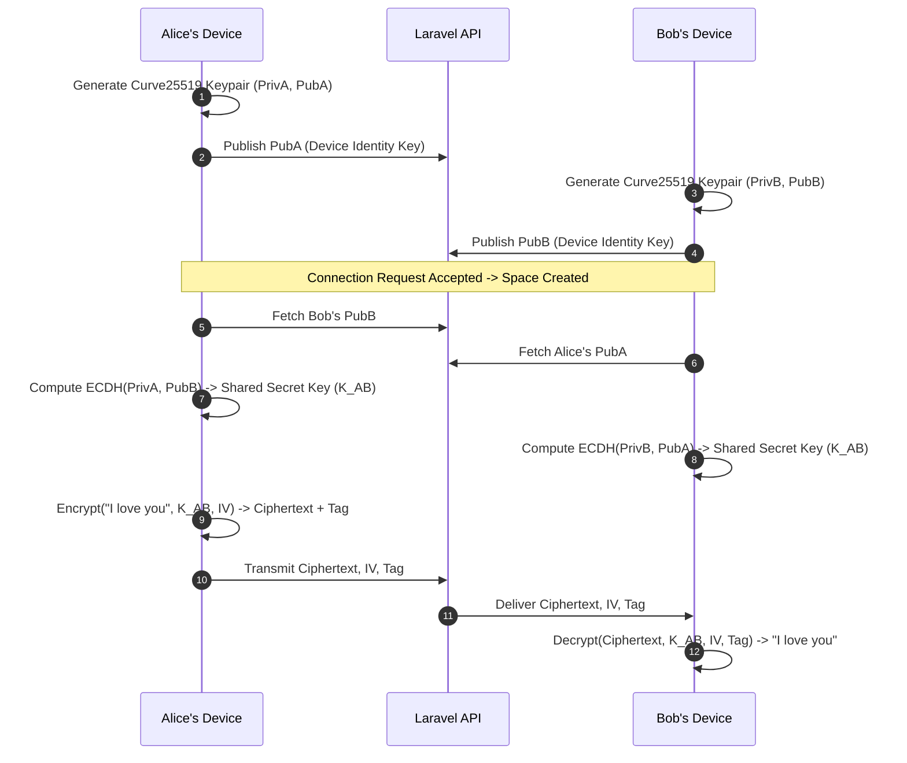

# COUPLE CONNECT – End-to-End Encryption (E2EE) Security Whitepaper

Couple Connect is engineered around zero-knowledge principles. Messages, voice notes, handwritten love letters, and shared sensitive documents are encrypted on device before ever touching the network.

---

## 1. Cryptographic Primitives

- **Asymmetric Key Agreement:** Curve25519 (ECDH) Key Exchange
- **Symmetric Encryption:** AES-256-GCM (Authenticated Encryption with Associated Data)
- **Key Derivation:** HKDF with SHA-256
- **Integrity Validation:** HMAC-SHA256 authentication tags (`mac`)
- **Nonce Generation:** 96-bit (12-byte) cryptographically secure CSPRNG initialization vectors (`iv`)

---

## 2. Key Exchange Workflow

---

## 3. Threat Model & Protections

1. **Zero Knowledge Server Storage**:
   - The Laravel 12 backend and MySQL database store only high-entropy base64 ciphertexts. Even with complete database compromise, attackers cannot read any plaintext messages, letters, or voice transcripts.
2. **Replay Attack Resistance**:
   - Every message encapsulates a unique UUID and fresh 12-byte IV. Duplicate nonces trigger client-side rejection.
3. **Biometric & PIN Application Sandboxing**:
   - Private keys and session secrets are stored in iOS Keychain / Android Keystore / FlutterSecureStorage and wiped upon logout or repeated PIN failure.
